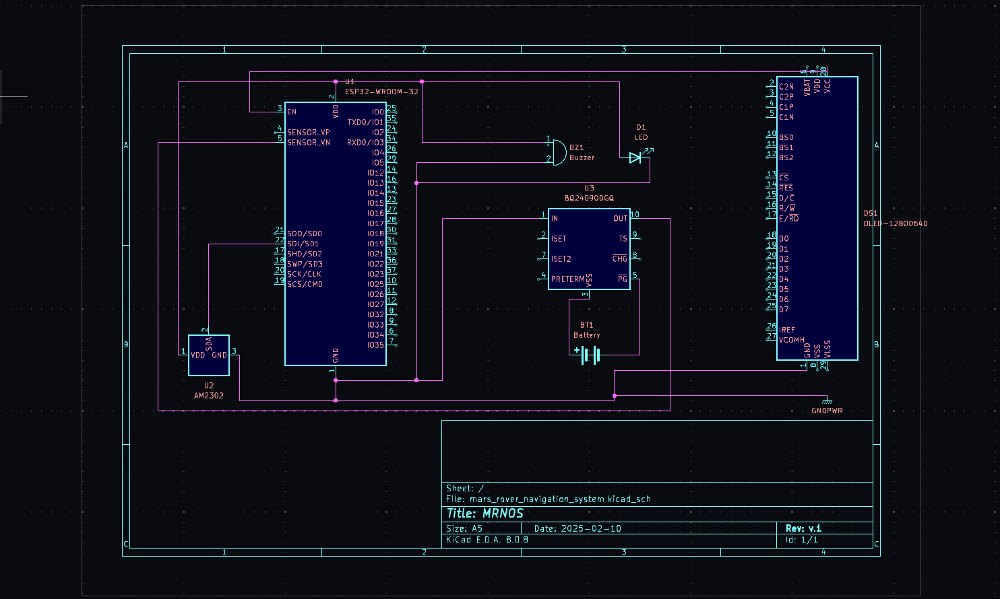

# Mars Rover Navigation Optimization System (MRNOS) 🛰

The Mars Rover Navigation Optimization System is a project by **[Tejas Gupta](https://github.com/multiverseweb)** , **[Ojas Gupta](https://github.com/ojas-git)**, Bhavya Jain and Dev Jain developed under the guidance of **`Prof. Bindu Garg`**, HOD, CSE & CSBS, Bharati Vidyapeeth University, College of Engineering, Pune. It is a scaled-down prototype designed to explore real-time environmental monitoring and data-driven decision-making. The project focuses on collecting temperature and humidity readings to analyze climate conditions and detect anomalies that could impact autonomous navigation.

  
  
  
  
  
  
  

## Research Hypothesis
A scaled-down Mars Rover prototype can effectively collect temperature and humidity data, demonstrating how real-time environmental monitoring can be used for autonomous navigation, climate analysis, and anomaly detection.  

By analyzing the collected data, we aim to identify trends, evaluate sensor accuracy, and explore potential improvements in robotic exploration. This includes assessing response time, consistency, and anomalies caused by external factors like human interference or sudden environmental changes.  

## Objective
- To explore potential improvements in robotic exploration through data-driven insights.
- Collect and transmit thermal data wirelessly to a computer.
- Detect obstacles using ultrasonic sensors.
- Indicate path changes via buzzer and LED.
- Safeguard navigation based on temperature and obstacles.
- Log and analyze data on a laptop using ThingSpeak.

## Components

| Category | Component |
|-|-|
| Microcontroller and Communication |ESP32 / Wroom 32D |
| Sensors | HC-SR04 Ultrasonic Sensor (Obstacle detection), DHT22 (Temperature sensor) |
| Circuit and Indicators | PCB (For circuit connections), Buzzer & LED (For warnings and path indication) |
| Power Supply | Lithium-ion battery (18650), Battery charger |
| Display | OLED Display (0.96" or 1.3", SSD1306/SH1106, I2C/SPI) |
| Data Handling | Data will be transmitted and analyzed using ThingSpeak. The Arduino API will be used for interfacing and control. |

## Circuit

|  |
|-|

## Environmental Sensor Readings from Mars Rover Prototype

### 🔗 Dataset 
| |  |  |
|-|-|-|

### What the Data Shows
This dataset contains `5,400` timestamped temperature and humidity readings collected over a period of `3` hours and logged every `2` seconds by the rover’s onboard DHT22 sensor. The data highlights:
- Gradual fluctuations in environmental conditions.
- Notable temperature spikes ``(~10°C)`` introduced using a lighter to test sensor response.
- Stable humidity levels with minor deviations due to air circulation or sensor drift.

### Notable Findings
- **Controlled Temperature Spikes:** Short bursts of heat resulted in clear temperature increases `(~10°C)`, demonstrating the sensor's ability to detect and log transient changes.
- **Humidity Stability:** Humidity levels remained within a narrow range, confirming minimal impact from applied temperature fluctuations.
- **Gradual Environmental Variations:** Small temperature and humidity shifts were observed, likely due to ambient conditions and ventilation effects.

### How the Data Was Gathered
- **Sensor Used:** DHT22 (for temperature & humidity).
- **Data Collection Frequency:** Logged every few seconds.
- **Controlled Testing:** Heat spikes added using a lighter to simulate external interference.
- **Data Transmission:** Logged in real-time via wireless communication to a laptop.

### How to Interpret and Use the Data
- **Identify Trends:** Observe temperature and humidity variations over time.
- **Detect Anomalies:** Locate sharp temperature spikes (`~10°C` increases) caused by external heating.
- **Compare Sensor Performance:** Evaluate how quickly temperature normalizes after a spike.
- **Develop Predictive Models:** Train machine learning models to predict environmental changes.

### Potential Applications
- **Autonomous Environment Monitoring:** Detecting and responding to environmental anomalies.
- **Sensor Calibration & Validation:** Testing DHT22 sensor accuracy under different conditions.
- **Climate Simulation & Research:** Indoor climate modeling & environmental trend analysis.
- **Robotics & AI:** Training AI for automated responses to climate fluctuations.

## License

This project is open-source under the [CC BY 4.0](https://github.com/multiverseweb/mars_rover/blob/main/LICENSE.md).

